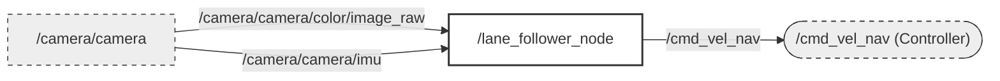

# Autonomous Track Tracking

   

##  Technical Features

### 1. Visual Perception (Blob-based Tracking)
The robot identifies the driving track using color-based segmentation in the **HSV color space**. 
- **Dynamic ROI (Region of Interest):** To reduce computational load and eliminate noise from the background, the system ignores the top 20% and bottom 10% of the camera frame.
- **Color Segmentation:** Specifically tuned to detect mint/green tracks using `cv::inRange`.
- **Morphological Operations:** Uses `Opening` and `Closing` filters to remove salt-and-pepper noise and bridge gaps in the detected lane.
- **Centroid Calculation:** Computes the "Center of Mass" of the largest contour to determine the target steering point.

### 2. IMU-Assisted Correction
Unlike traditional line followers, this system uses the **Linear Acceleration (X-axis)** from an IMU (e.g., Intel RealSense) to compensate for physical tilts or sudden movements.
- **Directional Bias:** If the robot detects a significant lateral force ($|a_x| > 3.0$ or $5.0$), it applies a 10-degree (in radians) steering offset to prevent drifting.
- **Visual Feedback:** A yellow "IMU Target" dot is rendered on the debug screen to visualize the compensated trajectory.

### 3. Control Strategy (PD Control)
The steering is governed by a **Proportional-Derivative (PD) Controller**:
- **P-Term:** Corrects the current error relative to the lane center.
- **D-Term:** Dampens oscillations by reacting to the rate of change in error.
- **Dynamic Speed:** The linear velocity automatically scales down during sharp turns to ensure traction and tracking accuracy.

---

## 📁 File Descriptions

| File | Role | Key Functions |
| :--- | :--- | :--- |
| `config.hpp` | **Central Configuration** | Defines PID constants, Camera resolution, ROI limits, and speed parameters. |
| `VisionProcessor.hpp` | **The "Eyes"** | Handles HSV filtering, morphological noise reduction, and binary mask generation. |
| `RobotController.hpp` | **The "Driver"** | Implements the PD control logic to convert pixel error into angular velocity. |
| `main1.cpp` | **Node Integrator (v1)** | Main ROS 2 Node. Implements IMU threshold at $\pm 3.0$ for high sensitivity. |
| `main2.cpp` | **Node Integrator (v2)** | Same as v1 but with a $\pm 5.0$ IMU threshold for more stable environments. |

##  System Architecture

Designed with a **modular Topic-Subscriber architecture** to enable multi-node concurrency without hardware conflict:

1.  **Sense**: RealSense D455 streams aligned RGB-Depth and IMU data. (or gv7-microsrtain)
2.  **Perceive**: `autonomous_track_tracking` (this node) identifies the track and calculates `cmd_vel_nav`.
3.  **Recognize**: YOLOv8 handles mission-critical objects (Red flags, traffic signals).
4.  **Act**: `Mission Manager` arbitrates all navigation and mission inputs for final vehicle control.commands (`cmd_vel`).

##  Getting Started

*   ROS 2 Humble
*   OpenCV 4.x
*   cv_bridge
*   Eigen3 (`sudo apt install libeigen3-dev`)

realsence code
```
ros2 launch realsense2_camera rs_launch.py \
  enable_color:=true \
  enable_depth:=false \
  rgb_camera.color_profile:=848x480x15 \
  align_depth.enable:=false \
  enable_sync:=true \
  enable_gyro:=true \
  enable_accel:=true \
  unite_imu_method:=2
```
run code
```
ros2 run linetracing_cpp main1_node (or main2_node)
```
run by launch 
```
ros2 launch linetracing_cpp track.launch.py
```
## Topic

```
ros2 topic echo /cmd_vel_nav
ros2 topic echo /camrea/camera/imu
```
+ when you use microstrain, you have to change topic name to imu/data
## Driving in fact
[스크린캐스트 07-23-2026 08:43:30 PM.webm](https://github.com/user-attachments/assets/b6f8ea2f-f1d2-4ed6-8c13-71e336da1edd)

main1.node (without imu)

https://github.com/user-attachments/assets/1ae48b25-744f-43de-8b89-e6ec5a973423

main2.node (include imu)

https://github.com/user-attachments/assets/d9cf8253-4c3e-4f82-bedf-540f6e9023d1


